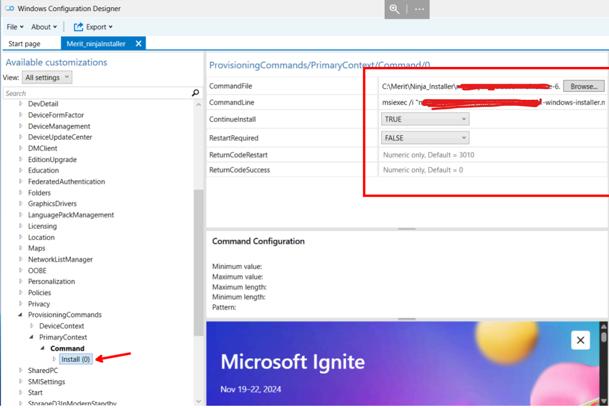

# OSD

## Introduction to OSDCloud
OSDCloud is a powerful PowerShell module designed to deploy Windows operating systems
directly from Microsoft's cloud. It allows system integrators, like Managed Service Providers
(MSPs), to automate and streamline the installation of Windows 10/11 by leveraging Windows
Deployment Services and cloud-hosted media. This process is particularly useful for deploying
clean, customized installations with minimal local infrastructure. More information can be found
on the projects website - https://www.osdcloud.com/

## Benefits of OSDCloud:

- Simplifies OS deployment by downloading required Windows files directly from Microsoft.
- Reduces dependency on traditional imaging solutions.
- Supports dynamic installation with minimal manual intervention.
- Enables customization through PowerShell scripting, including the use of custom
- unattended XML files.

## Overview of the Deployment Process

### Step 1: Preparing the Development Environmen

1. Prepare a development machine or VM running Windows Server or Windows 11.
2. Install prerequisites and configure OSDCloud.
3. Set up the workspace and customize the deployment media.
4. Generate and deploy the installation USB.
5. Automate the Windows installation with a pre-configured unattend.xml file.

### Step 2: Installing Prerequisites and OSDCloud

Use the following PowerShell script to automate the installation of required tools, including the Windows ADK, WinPE Add-on, and OSDCloud PowerShell module. 

PowerShell Script: Install Prerequisites 
||
[OSDCloud_Install.ps1](OSDCloud%20Create/OSDCloud_Install.ps1)
 
 ### Step 3: Configuring the Workspace and Media

 Once the prerequisites are installed, use the following script to set up your OSDCloud workspace, customize the media, and copy your unattend.xml file

 PowerShell Script: Workplace Setup
 ||
[create_OSDCloud_Template.ps1](OSDCloud%20Create/create_OSDCloud_Template.ps1)
 
 Within this script there's a reference to a WebPSScript that is stored in GitHub. This is the script that is ran within the WinPE phase that tells OSDCloud what version of Windows to install, what
language, and what license to use.

 ### Step 4: Creating the Installation Media

 Run the following command to create a bootable USB from your 
 customized ISO:
 ```powershell
 New-OSDCloudUSB -FromIsoFile "C:\merit\NEW\OSDCloud.iso"
```

 ### Step 5: Create Provisioning Package
1. Install Windows Configuration Designer from the Microsoft Store, Winget, or the official
Microsoft website.
2. Open the Windows Configuration Designer app.
3. On the main screen, click Advanced Provisioning
4. Enter a project name and description in the dialog that appears.
5. In the next dialog, select "All Windows Desktop Editions" (second option).
6. Click Finish on the next dialog that asks whether to import a package (optional).
7. On the left panel, expand Runtime settings.
8. Navigate to ProvisionCommands > PrimaryContext > Command.
9. Enter a Name for the command (e.g., Install ). Then, click Add to create a new
command entry.
10. On the left panel, expand the newly created command (it will appear under Command).
11. Fill in the command details:
12. Refer to the screenshot example:



13. On the top menu, click Export.
14. Choose Provisioning package.
15. Select a Build path where the PPKG file will be saved, then click Next.
Step 6: Deploy Windows 11
Conclusion
By following this guide, you can automate the installation of Windows 11 using OSDCloud,
minimizing manual setup and providing a consistent deployment method for MSP clients. This
documentation ensures your team can replicate the process efficiently.
16. Click Next on the Security details dialog (you can skip adding a password for simplicity
unless required).
17. Click Next on the confirmation dialog.
18. Click Build to create the provisioning package.
19. Once built, navigate to the OSDCloud USB that was created.
20. On the WinPE partition of the USB, create a new folder named OSDCloud / Automate.
21. Within the Automate folder, create another folder named Provisioning.
22. Copy the generated Provisioning Package (with a .ppkg extension) to this directory

### Step 6: Deploy Windows 11

1. Boot from the OSDCloud USB on the target machine.
2. The process will automate the installation of Windows 11.
3. Once complete, the system will be ready with a local administrator account with the Ninja agent installed


### Conclusion
By following this guide, you can automate the installation of Windows 11 using OSDCloud, minimizing manual setup and providing a consistent deployment method for MSP clients. This documentation ensures your team can replicate the process efficiently.